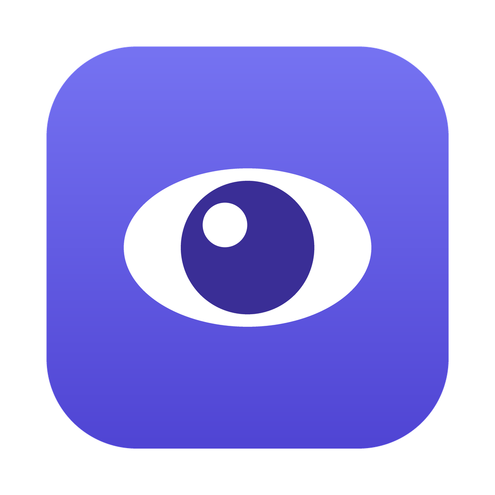

  

# Buddy 👁️

**Your private, on-device screen memory + AI agent for macOS.**

Buddy quietly remembers what's on your screen so you can scroll back through your day, search it by keyword *or meaning* ("what was that invoice number this morning?"), ask an AI about your work — and let it take actions on your behalf, under permission rules you control.

Everything is captured, transcribed, and indexed **locally, encrypted, on your Mac**. Only the minimal context for a question you explicitly ask is ever sent to Claude.

<!-- SCREENSHOTS: timeline view · Ask Buddy chat with cited answer · Approvals queue -->

## What Buddy does

- **Remembers your screen** — captures with ScreenCaptureKit, saving frames only on meaningful change (app switch, pixel delta, heartbeat) to keep CPU and disk low
- **Reads everything** — Accessibility tree first, Vision OCR to fill the gaps (yes, even the Figma canvas)
- **Hears you** — on-device microphone transcription (SFSpeechRecognizer); nothing leaves your Mac
- **Finds anything** — encrypted SQLite timeline with keyword (FTS5) *and* semantic search
- **Answers with receipts** — ask natural-language questions, get **cited** answers that jump the timeline to the exact moment
- **Acts, with your permission** — Buddy can create notes and draft posts via Claude tool-use, each action gated **Off / Ask / Auto**, with an approvals queue and an append-only audit log
- **Private by design** — AES-GCM-encrypted frames, password managers excluded, one-click Pause, automatic pruning

## Install

1. Download the latest `Buddy-X.Y.Z.dmg` from [Releases](../../releases) and open it
2. Drag **Buddy** into **Applications**
3. **First launch (one time):** macOS will say it "cannot verify the developer" — open **System Settings → Privacy & Security**, scroll to the *Buddy* note, click **Open Anyway**
4. Grant **Screen Recording** and **Accessibility** when prompted

Buddy lives as a 👁️ icon in your menu bar (no Dock icon by design) and updates itself automatically.

> Buddy isn't yet signed with an Apple Developer ID, so macOS shows that one-time prompt. After an update you may need to re-grant Screen Recording + Accessibility — this goes away once Buddy ships notarized.

**Requires macOS 14 (Sonoma) or newer.**

## Why this exists

The hard part of personal AI isn't the model — it's **trust and legibility**: what is it allowed to see, what is it allowed to do, and can you audit what it did? Buddy is my working answer: local-first capture, cited answers, and an Off/Ask/Auto autonomy dial with an approval queue.

## Built by

**Victor Adedini** — product designer who ships. Designed and built end-to-end with AI-assisted development (Swift/SwiftUI + Claude).

- Portfolio: [uxvic.framer.website](https://uxvic.framer.website)
- LinkedIn: [linkedin.com/in/uxvic](https://www.linkedin.com/in/uxvic)
- Twitter/X: [@Victor_Adedini](https://x.com/Victor_Adedini)
